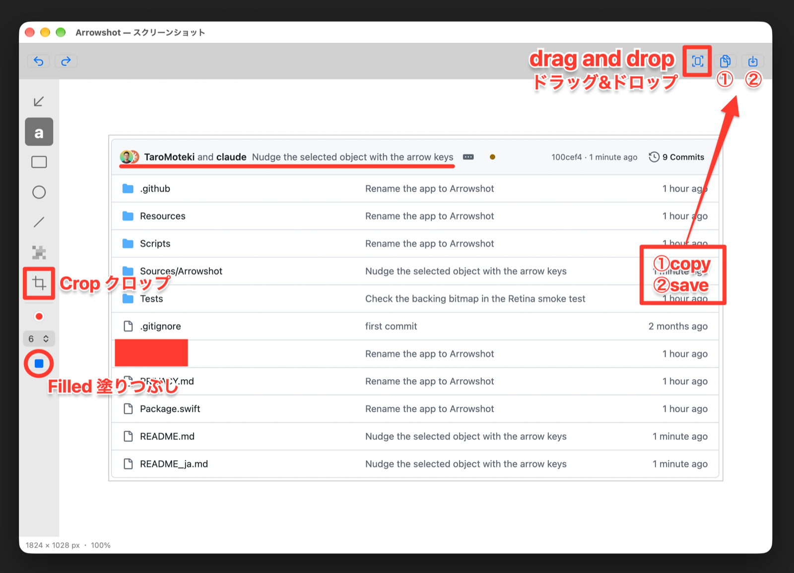

# Arrowshot

[English](README.md)

Arrowshot は、「ここを見て」を伝えるための軽量な macOS 用スクリーンショットツールです。画面の一部を撮って、太い矢印や文字を書き込み、そのままチャット・メール・ドキュメントへドラッグして貼れます。Skitch の使い心地を手本にしています。

処理はすべて Mac の中で完結します。アカウント登録・クラウド・ネットワーク通信は一切ありません。



## 主な機能

- **Skitch 風の矢印**：先端に向かって太くなる軸と、やわらかい影。ひと目で伝わる形に調整しています
- **目立つ文字**：白フチと影つきの赤い文字。どんな背景でも読めます
- **四角・楕円（塗りつぶしも可）・直線・モザイク・切り取り**：切り取りは画像の外側まで広げられます
- **ドラッグで書き出し**：ツールバーから、完成した画像をファイル保存せずにほかのアプリへドラッグできます
- **グローバルショートカット**：どのアプリを使っていても撮影できます。撮影のショートカットはすべて[設定](#設定)で変更できます
- **Retina 画質**：ディスプレイ本来の解像度のまま撮影します
- **英語と日本語に対応**：macOS の言語設定に合わせて切り替わります。設定画面で選ぶこともできます
- 表示の拡大縮小（ピンチ、⌘+／⌘−／⌘0）、Shift で線・矢印を 45° 単位に固定、取り消し／やり直し、PNG・JPEG 保存、クリップボードへのコピー

## ショートカット

### どのアプリからでも使えるもの

| 操作 | 標準のキー | 変更 |
|---|---|---|
| 範囲・ウインドウを撮影 | ⌘⇧2 | できる |
| タイマーつきで撮影 | ⌘⇧1 | できる |
| 全画面を撮影 | ⌘⌥⇧3 | できる |

### 編集画面で使えるもの

| 操作 | ショートカット |
|---|---|
| 保存／名前を付けて保存 | ⌘S／⌘⇧S |
| クリップボードにコピー | ⌘C |
| 取り消す／やり直す | ⌘Z／⌘⇧Z |
| 拡大／縮小／ウインドウに合わせる | ⌘+／⌘−／⌘0 |
| 設定を開く | ⌘, |
| 選択したものを動かす | 十字キー（1ポイントずつ）、Shift＋十字キー（10ポイントずつ） |
| ツールの切り替え | A（矢印）・T（文字）・R（四角）・O（楕円）・L（直線）・M（モザイク）・C（切り取り）、または 1〜7 |

## 設定

Arrowshot を使っているときに ⌘, を押すと設定画面が開きます（Dock のアイコンをクリックしてから押してください）。メニューバーのアイコンからも開けます。変更できるのは次の5つです。

- **撮影のショートカット**：欄をクリックして、割り当てたいキーを押します（⌘・⌃・⌥のどれかを含めてください）。「デフォルトに戻す」で元のキーに戻せます。
- **保存先**：⌘S ですぐ保存するときのフォルダです。最初は「ダウンロード」です。
- **標準の形式**：⌘S とドラッグ書き出しで使う形式を PNG か JPEG から選べます。名前を付けて保存（⌘⇧S）ではその都度選べます。
- **タイマーの秒数**：タイマーつき撮影の待ち時間を 3 秒か 5 秒から選べます。
- **言語**：「システムに合わせる」「English」「日本語」から選べます。切り替えると再起動するか聞かれます。

## 動作環境

- macOS 14 Sonoma 以降
- Apple シリコン／Intel Mac（ユニバーサルバイナリ）
- 「画面収録」の許可

## インストール

1. [Releases](../../releases) から最新の `Arrowshot-x.y.z.zip` をダウンロードして展開します。
2. `Arrowshot.app` を「アプリケーション」フォルダへ移します。
3. Apple の公証を受けていないため、初回は macOS に起動を止められます。一度開こうとしたあと、**システム設定**の「**プライバシーとセキュリティ**」で「**このまま開く**」を押してください。
4. ⌘⇧2 を押し、画面収録の許可を求められたら許可します。許可したあと、Arrowshot を一度終了して開き直してください。

## ソースからビルドする

Xcode が必要です。

```sh
Scripts/build-app.sh release
open .build/Arrowshot.app
```

macOS は画面収録の許可をアプリの署名に結びつけるため、通常のビルドでは再ビルドのたびに許可を求められます。許可を保ち続けたい場合は、固定の自己署名証明書を一度だけ作成してください。

```sh
Scripts/setup-signing.sh
```

ログインキーチェーンに「Arrowshot Local Signing」という証明書を作り、ビルド・署名・`/Applications` へのインストールまで行います。

テストの実行：

```sh
swift test
Scripts/run-core-tests.sh
```

インストーラーパッケージは `Scripts/build-pkg.sh release` で作成できます。

## プライバシー

Arrowshot には、利用状況の収集・アカウント・自動アップデート・ネットワーク通信の仕組みがありません。撮影した画像は、保存またはコピーするまでメモリ上にだけ置かれます。詳しくは [PRIVACY.md](PRIVACY.md) をご覧ください。

## クレジット

Arrowshot は、sikkimtemi さんの [PictoJot](https://github.com/sikkimtemi/PictoJot)（MIT ライセンス）をもとに作られています。しっかりした土台に感謝します。

## ライセンス

[MIT License](LICENSE)
