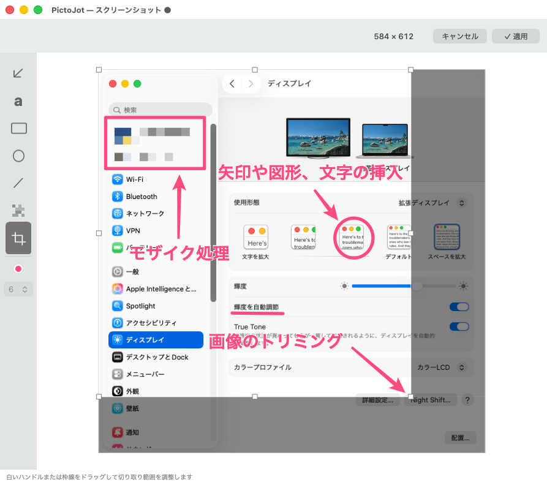

# PictoJot

[English](README.md)

PictoJotは、画面キャプチャと簡単な注釈を行うmacOS用メニューバーアプリです。キャプチャ画像はローカルで処理し、アカウントやネットワーク接続を必要としません。



## 動作環境

- macOS 14以降
- Apple SiliconまたはIntel Mac（Universal Binary）
- 画面キャプチャに「画面収録」権限が必要

## 実装済み機能

- メニューバー常駐（編集ウインドウ表示中はDockアイコンとアプリケーションメニューを表示）
- 初回起動時にログイン時の自動起動を選択可能
- 主ディスプレイと拡張ディスプレイでの矩形／ウインドウキャプチャ
- 矩形確定後の5秒タイマーキャプチャ
- 一般的な画像形式のドラッグ＆ドロップ
- 矢印、テキスト、長方形、楕円、直線
- 注釈の移動、拡大縮小、対応オブジェクトの回転
- 色と太さの変更
- モザイク、切り取り
- Undo／Redo
- PNG保存、クリップボードへのコピー

自由入力とスタンプは対象外です。

## ビルド

ローカル用のアドホック署名済み`.app`を生成します。

```sh
Scripts/build-app.sh release
open .build/PictoJot.app
```

デバッグビルドは次のとおりです。

```sh
Scripts/build-app.sh debug
```

開発用バンドルIDは環境変数で上書きできます。

```sh
PICTOJOT_BUNDLE_IDENTIFIER=org.example.PictoJot Scripts/build-app.sh release
```

完全なXcodeがある環境では、`Package.swift`をXcodeで開くか、次を実行します。

```sh
swift test
```

XCTestを利用できない環境向けのコアロジックテストは次のとおりです。

```sh
Scripts/run-core-tests.sh
```

## インストールパッケージ

PictoJotを`/Applications`へインストールし、インストール完了後に起動するローカルテスト用パッケージを生成できます。

```sh
Scripts/build-pkg.sh release
open .build/PictoJot-0.1.3.pkg
```

通常はアプリ、パッケージともローカルテスト用署名です。一般配布ではDeveloper ID Application／Installer証明書を指定します。

```sh
PICTOJOT_APP_SIGN_IDENTITY="Developer ID Application: Example (TEAMID)" \
PICTOJOT_INSTALLER_SIGN_IDENTITY="Developer ID Installer: Example (TEAMID)" \
Scripts/build-pkg.sh release
```

一般公開前には、このパッケージの公証とステープルも必要です。

## 使い方

1. アプリを起動し、メニューバーアイコンからキャプチャ方法を選びます。
2. ドラッグで範囲を選択するか、対象ウインドウをクリックします。
3. 左サイドバーで注釈ツールを選択し、画像上をドラッグします。
4. 既存の注釈にマウスを重ねてクリックすると、移動や変形ができます。
5. 完成した画像をコピーするか、PNGで保存します。

タイマー版でも、ウインドウをクリックした場合は待機せずに取得します。選択中はEscキーまたは右クリックでキャンセルできます。

## 権限

初回キャプチャ時にmacOSから画面収録の許可を求められます。取得できない場合は、「システム設定」→「プライバシーとセキュリティ」→「画面収録」でアプリを許可し、再起動してください。

## プライバシーとセキュリティ

分析、アカウント、アップデータ、ネットワーク通信は実装していません。詳細は[PRIVACY.md](PRIVACY.md)と[SECURITY.md](SECURITY.md)を参照してください。

## ライセンス

ソースコードは[MIT License](LICENSE)で公開します。
